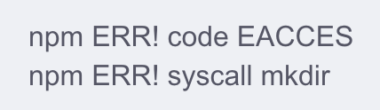

# Nodejs安装软件遇见的问题及解决方法

## 安装React-Native
```
myw@mengyawendeMacBook-Pro project % react-native init SimpleApp
zsh: command not found: react-native
myw@mengyawendeMacBook-Pro project % npm install -g react-native-cli
npm ERR! code EACCES
npm ERR! syscall mkdir
npm ERR! path /usr/local/lib/node_modules/react-native-cli
npm ERR! errno -13
npm ERR! Error: EACCES: permission denied, mkdir '/usr/local/lib/node_modules/react-native-cli'
npm ERR!  [Error: EACCES: permission denied, mkdir '/usr/local/lib/node_modules/react-native-cli'] {
npm ERR!   errno: -13,
npm ERR!   code: 'EACCES',
npm ERR!   syscall: 'mkdir',
npm ERR!   path: '/usr/local/lib/node_modules/react-native-cli'
npm ERR! }
npm ERR! 
npm ERR! The operation was rejected by your operating system.
npm ERR! It is likely you do not have the permissions to access this file as the current user
npm ERR! 
npm ERR! If you believe this might be a permissions issue, please double-check the
npm ERR! permissions of the file and its containing directories, or try running
npm ERR! the command again as root/Administrator.

npm ERR! A complete log of this run can be found in:
npm ERR!     /Users/myw/.npm/_logs/2021-04-01T07_37_16_486Z-debug.log
```
解决方法：  
<https://blog.csdn.net/qq_31989047/article/details/114531241>  
  
解决办法：sudo chown -R $你的用户名 ~/.npm